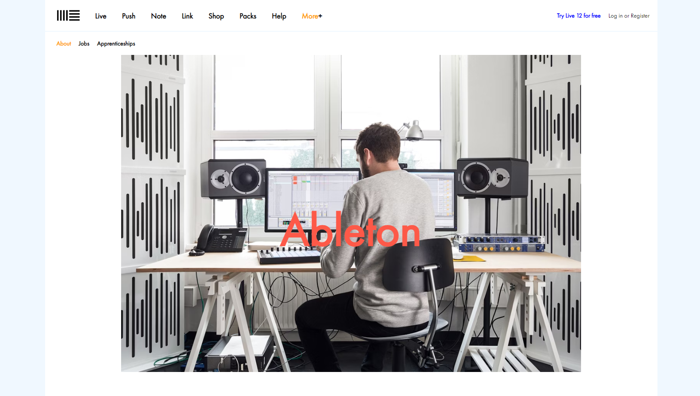
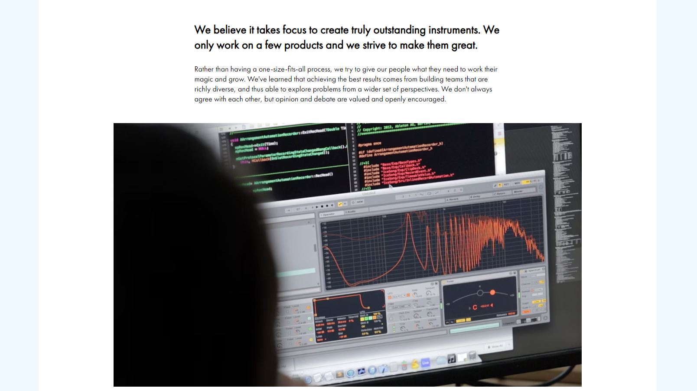
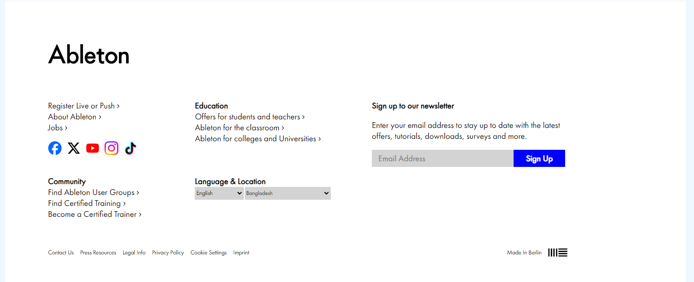

# 🎶 Ableton 🎶
# 🚀 [Live Site](https://zayed-z.github.io/ableton/)

This is a simple React project built using [Vite](https://vitejs.dev/). It serves as a practice project to get familiar with [ReactJS](https://react.dev/).

## 🔍 Preview

## 🛠️ Dependencies

## 💻 Running the Project Locally

1. Clone the repository to your local machine: `https://github.com/zayed-z/ableton`
2. Install Node JS. Refer to [NodeJS](https://nodejs.org/) for installation.
3. Navigate to the project directory: `cd <project-directory>`
4. Install the project dependencies: `npm install`
5. Start the app in development mode: `npm run dev`
6. Open [http://localhost:5173](http://localhost:5173) to view the app in the browser.

## Acknowledgments

- [React Documentation](https://react.dev/)
- [Vite Documentation](https://vitejs.dev/)